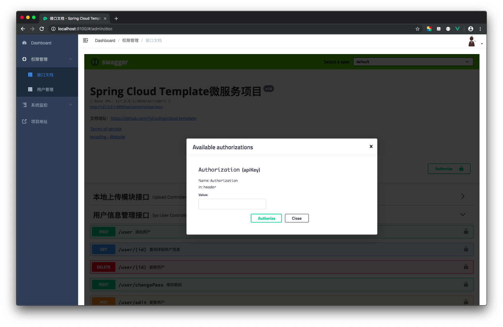
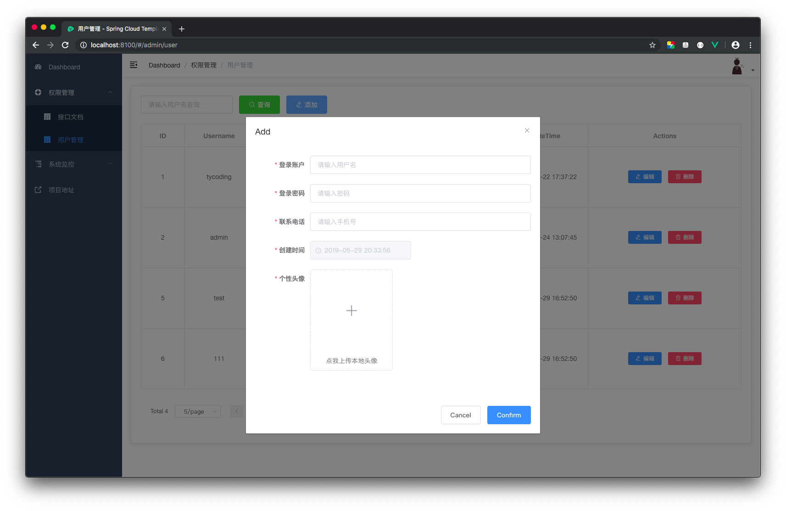

# Spring Cloud Template 分布式微服务系统 -- 后端

## 写在前面

在开始此项目前，请先学习这个基础项目模板 [cloud-template](https://github.com/TyCoding/cloud-template/tree/master/cloud-template) ，并仔细阅读以下开发文档：

[从零开始搭建Spring Cloud脚手架](https://github.com/TyCoding/cloud-template/blob/master/cloud-template/doc/env-1.md)

## 启动说明

1. 修改本地`hosts`文件，添加如下内容（可以通过 [SwitchHosts](http://oldj.github.io/SwitchHosts/) 快速修改）。

```
127.0.0.1 sct-eureka
127.0.0.1 sct-mysql
127.0.0.1 sct-auth
```

2. 修改`sct-config/src/main/resources/`下配置文件中的数据库连接信息，主要涉及`sct-admin-biz-dev.yml`和`sct-auth-dev.yml`两个文件

3. 导入项目根目录下的`base.sql`，建立数据库

默认密码请参看`sct-admin-biz/src/test/PasswordEncoderTest.java`工具类

| Username | Password |
| --- | --- |
| tycoding | tycoding |
| admin | admin |
| test | test |

4. 严格按照如下顺序依次启动服务模块

```
1. EurekaApplication.java -- 服务注册中心
2. ConfigApplication.java -- 服务配置中心
3. MonitorApplication.java -- Spring Boot Admin监控
4. ZipkinApplication.java -- Zipkin链路监控
5. AdminBizApplication.java -- 系统管理模块
6. AuthApplication.java -- 授权模块
7. GatewayApplication.java -- Zuul网关
```

5. 启动前端项目

```shell
$ cd sct-app
$ npm install
$ npm run dev
```


## 功能预览







